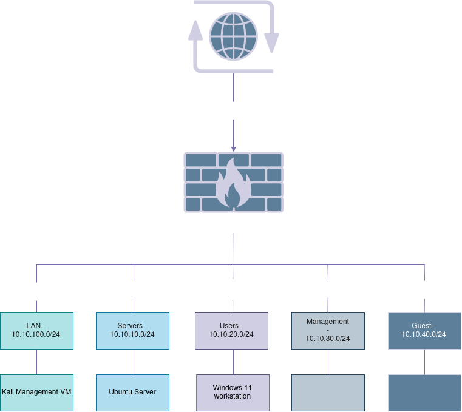

## Current Topology

* The chart will be updated as the project advances.

See [IP addressing](/IP%20adressing.md)

See [Firewall Policy](/Firewall%20Policy.md)
____

## Design Decisions

### Network Isolation and Internet Connectivity

To isolate the lab environment from the host machine's physical network, VirtualBox Internal Network adapters are used for the OPNsense interfaces serving the LAN, Users, Servers, Management, and Guests segments. These internal networks provide connectivity between attached virtual machines without directly exposing the segments to the host or the external network.

Where outbound Internet connectivity is required, the OPNsense WAN interface is connected to a VirtualBox NAT adapter. OPNsense serves as the gateway for the lab segments, forwarding permitted outbound traffic through its WAN interface, while VirtualBox NAT provides address translation toward the external network.

### Segmentation

Due to the limitations of VirtualBox's Internal Network adapters, configuring a traditional VLAN access-port architecture is not possible. Because VirtualBox's internal networks act akin to an unmanaged switch, they cannot automatically inject or strip 802.1Q tags for individual client virtual machines. To simulate a small-scale enterprise network with appropriate segmentation between different endpoint devices without forcing tedious VLAN configuration onto every guest OS, I have chosen to utilize multiple distinct VirtualBox internal network adapters.

